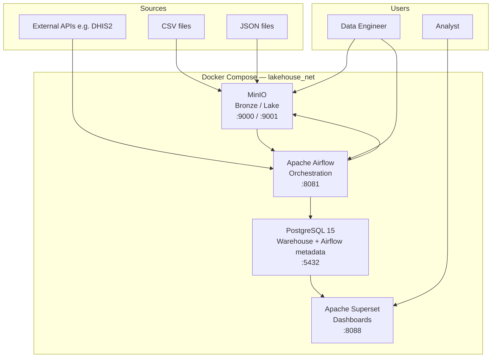
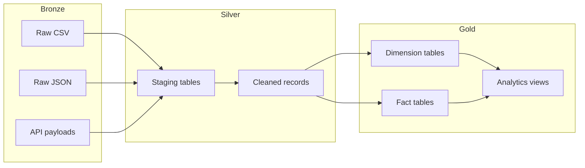
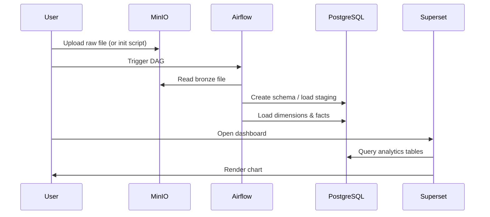
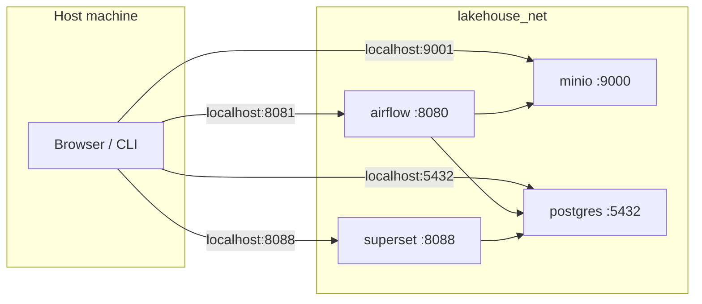
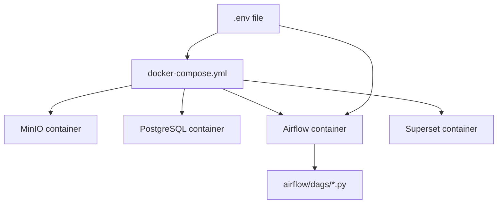
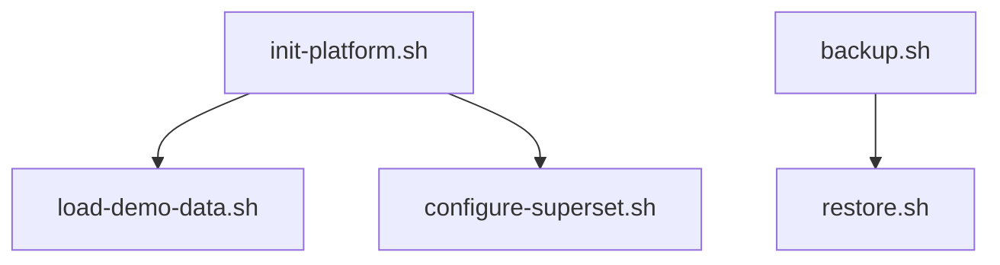
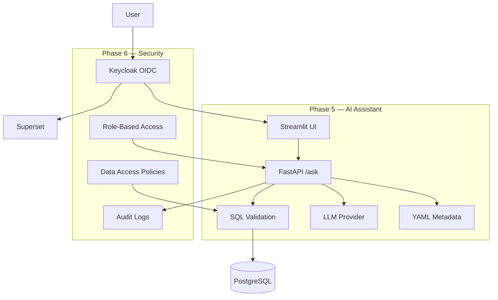

# Architecture Overview

The Open Analytics Platform is a self-contained, open-source analytics stack designed to run on-premise or locally via Docker Compose. It follows a medallion-style data architecture and is built to be domain-agnostic, configurable, and client-ready.

## High-level architecture

## Component reference

| Component | Layer | Role | Technology | Default port |
|-----------|-------|------|------------|--------------|
| **MinIO** | Bronze (lake) | Raw file storage — CSV, JSON, Parquet | S3-compatible object storage | 9000 (API), 9001 (console) |
| **PostgreSQL** | Gold (warehouse) | Structured analytics tables, dimensions, facts | PostgreSQL 15 | 5432 |
| **Airflow** | Orchestration | ETL scheduling, pipeline execution, metadata | Apache Airflow 2.7 | 8081 |
| **Superset** | Presentation | Charts, dashboards, SQL exploration | Apache Superset | 8088 |

Airflow metadata (DAG runs, connections, variables) is stored in the same PostgreSQL instance as the analytics data.

## Data flow

### Medallion pattern

### Pipeline flow (current)

1. **Ingest** — Raw files are uploaded to MinIO `bronze` bucket, or fetched by Airflow from external APIs (DHIS2).
2. **Stage** — Airflow DAGs read from MinIO and load into PostgreSQL staging tables.
3. **Transform** — Data is cleaned, deduplicated, and modeled into star schema (dimensions + facts).
4. **Serve** — Superset connects to PostgreSQL and exposes charts and dashboards to analysts.

## Network topology

All services run on a single Docker bridge network (`lakehouse_net`). Services reach each other by container/service name — not `localhost`.

Internal connection examples:

| From | To | Host to use |
|------|----|-------------|
| Airflow DAG | PostgreSQL | `postgres:5432` |
| Airflow DAG | MinIO | `http://minio:9000` |
| Superset | PostgreSQL | `postgres:5432` |
| Host machine | PostgreSQL | `localhost:5432` |

## Configuration architecture

All secrets and ports are externalized to `.env`. Docker Compose injects variables into containers; Airflow DAGs read them via `lib/platform_config.py`.

See [configuration.md](configuration.md) for the full variable reference.

## Deployment scripts

| Script | Purpose |
|--------|---------|
| `init-platform.sh` | Post-start initialization: wait for services, load demo, configure Superset |
| `load-demo-data.sh` | Upload sample files to MinIO and run ETL DAGs |
| `configure-superset.sh` | Register PostgreSQL connection in Superset |
| `backup.sh` | Snapshot PostgreSQL, MinIO, Superset metadata, and config |
| `restore.sh` | Restore from backup |

## Current pipelines

| DAG ID | Source | Target | Output |
|--------|--------|--------|--------|
| `csv_minio_to_postgres` | MinIO CSV | PostgreSQL | `raw_data` table |
| `json_to_star_schema` | MinIO JSON | PostgreSQL | Star schema (dims + facts) |
| `dhis2_to_star_schema` | DHIS2 API | MinIO → PostgreSQL | Star schema |

## Target architecture (Phases 5–6)

| Phase | Addition | Technology |
|-------|----------|------------|
| Phase 5 | Metadata-driven NL-to-SQL assistant | FastAPI, Streamlit, YAML metadata |
| Phase 5 | SQL validation and explainability | Python validation layer, audit tables |
| Phase 6 | Authentication | Keycloak, OpenID Connect |
| Phase 6 | Authorization | RBAC, row/table-level data policies |
| Phase 6 | Governance | Audit logs for queries, logins, exports |

## Design principles

1. **Domain-agnostic** — No hardcoded business logic; datasets and pipelines are configured externally.
2. **Reproducible** — Docker Compose + `.env` + init scripts = identical deployments.
3. **Metadata-driven AI** — The assistant (Phase 5) understands databases through YAML metadata, not model training.
4. **Security first** — SQL validation and access control before query execution (Phase 5–6).
5. **Operational readiness** — Backup/restore, documentation, and demo environment included from Phase 4.

## Technology stack summary

| Category | Technology |
|----------|------------|
| Analytics database | PostgreSQL 15 |
| Object storage | MinIO |
| Orchestration | Apache Airflow 2.7 |
| Business intelligence | Apache Superset |
| Containerization | Docker / Docker Compose |
| Configuration | Environment variables (`.env`) |
| AI assistant (planned) | FastAPI + Streamlit + LLM API |
| Identity (planned) | Keycloak (OIDC) |

## Related documentation

- [Repository Structure](repository-structure.md) — codebase layout
- [Configuration Guide](configuration.md) — environment variables
- [Installation Guide](installation-guide.md) — setup steps
- [Platform Overview](platform-overview.md) — stakeholder presentation
